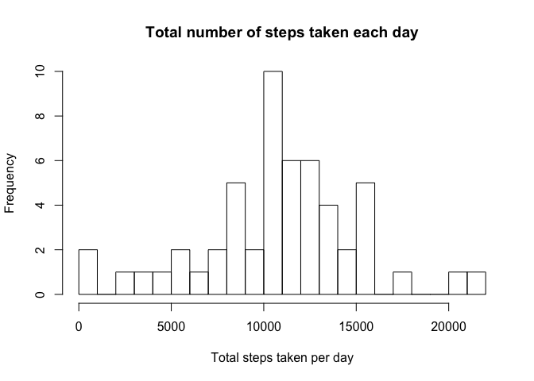
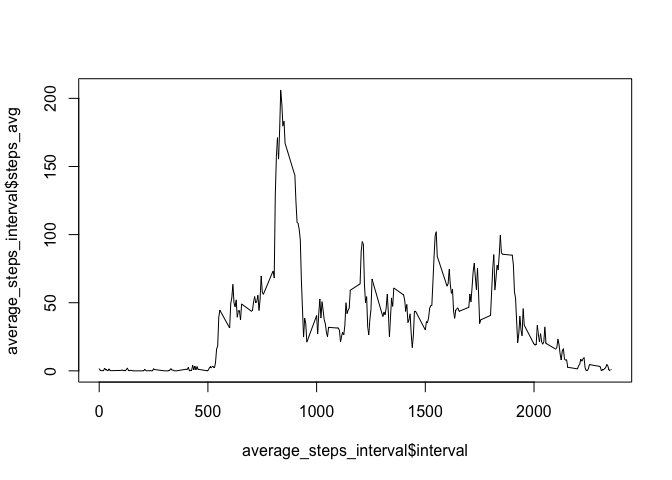
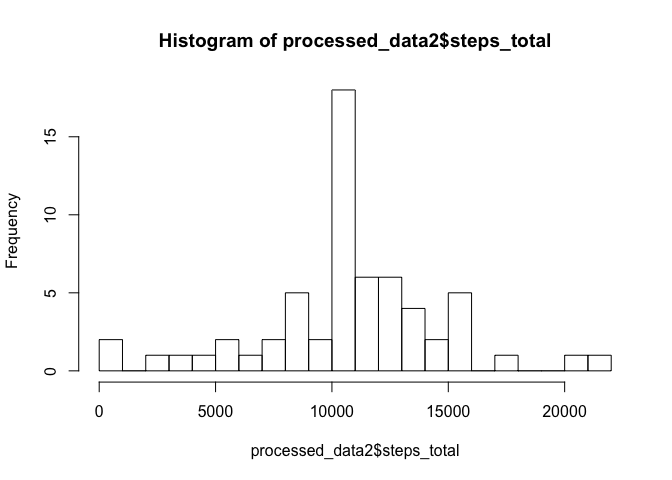
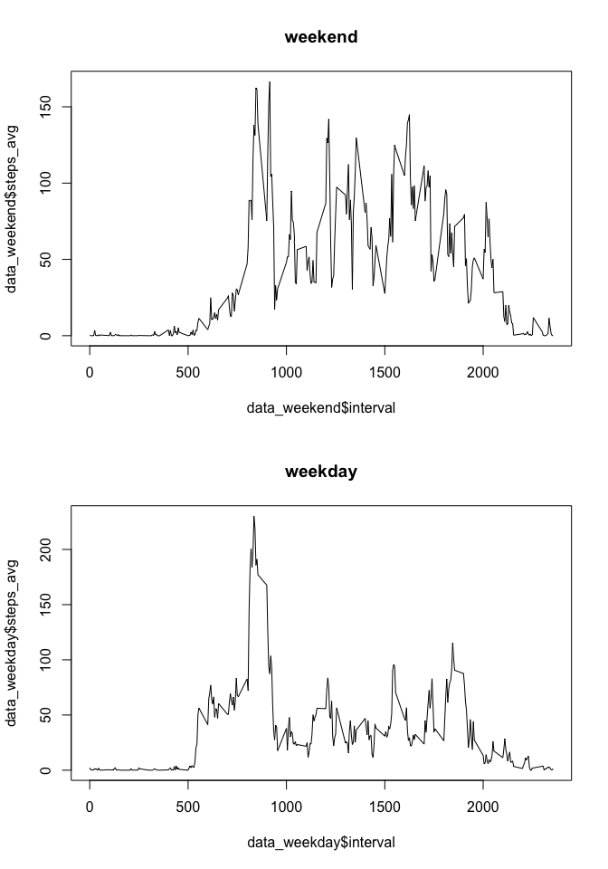

# Reproducible Research: Peer Assessment 1


## Loading and preprocessing the data


```r
unzip("activity.zip", "activity.csv")
data <- read.csv("activity.csv")
```

## What is mean total number of steps taken per day?


```r
library(plyr)
processed_data <- ddply(.data = data, "date", summarise, steps_total = sum(steps))
mean_steps <- round(mean(processed_data$steps_total, na.rm = TRUE),2)
median_steps <- median(processed_data$steps_total, na.rm = TRUE)
hist(processed_data$steps_total, breaks=30, main = "Total number of steps taken each day", xlab="Total steps taken per day")
```

 

Mean of the total number of steps taken per day: 1.076619\times 10^{4}

Median of the total number of steps taken per day: 10765

## What is the average daily activity pattern?


```r
average_steps_interval<- ddply(.data = data, "interval", summarise, steps_avg = mean(steps, na.rm=TRUE))
plot(average_steps_interval$interval, average_steps_interval$steps_avg, type = "l")
```

 

```r
interval_with_maximum_number_steps <-average_steps_interval[average_steps_interval$steps_avg == max(average_steps_interval$steps_avg),1]
```

Interval with the maximum number of steps taken per day: 835

## Imputing missing values


```r
data2 <- data
#Replace NA with the average of the interval
for(i in 1:nrow(data2)){
  if(is.na(data2$steps[i])) {
    data2$steps[i] <- mean(data2$steps[data2$interval ==  data2$interval[i]], na.rm = TRUE)
  }
}
#Summarize the data
processed_data2 <- ddply(.data = data2, "date", summarise, steps_total = sum(steps))
mean_steps_replaced_NA <- mean(processed_data2$steps_total, na.rm = TRUE)
median_steps_replaced_NA <- median(processed_data2$steps_total, na.rm = TRUE)
hist(processed_data2$steps_total, breaks=30)
```

 

Mean of the total number of steps taken per day (replaced NA data): 1.0766189\times 10^{4}

Median of the total number of steps taken per day (replaced NA data): 1.0766189\times 10^{4}

## Are there differences in activity patterns between weekdays and weekends?


```r
#Creates the Field
data2[,"DayOfWeek"] <- ""
data2[as.POSIXlt(as.Date(data2$date))$wday %in% 1:5 , "DayOfWeek"] <- "weekday"
data2[(as.POSIXlt(as.Date(data2$date))$wday == 0) | (as.POSIXlt(as.Date(data2$date))$wday == 6) , "DayOfWeek"] <- "weekend"
processed_data3 <- ddply(.data = data2, c("interval","DayOfWeek"), summarise, steps_avg = mean(steps))
data_weekend <- processed_data3[processed_data3$DayOfWeek == "weekend",]
data_weekday <- processed_data3[processed_data3$DayOfWeek == "weekday",]
```

```r
par(mfrow=c(2,1))
plot(data_weekend$interval, data_weekend$steps_avg, type = "l", main = "weekend")
plot(data_weekday$interval, data_weekday$steps_avg, type = "l", main = "weekday")
```

 
